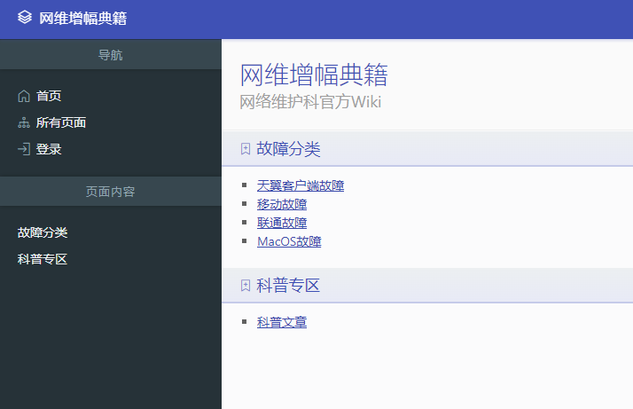
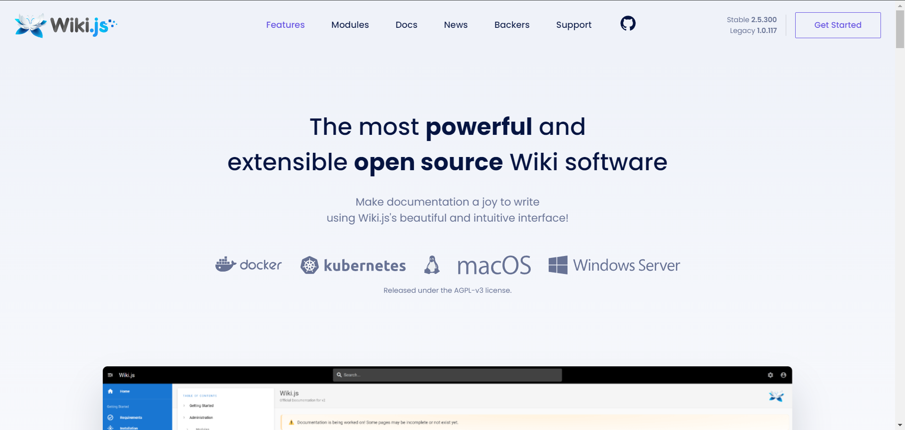
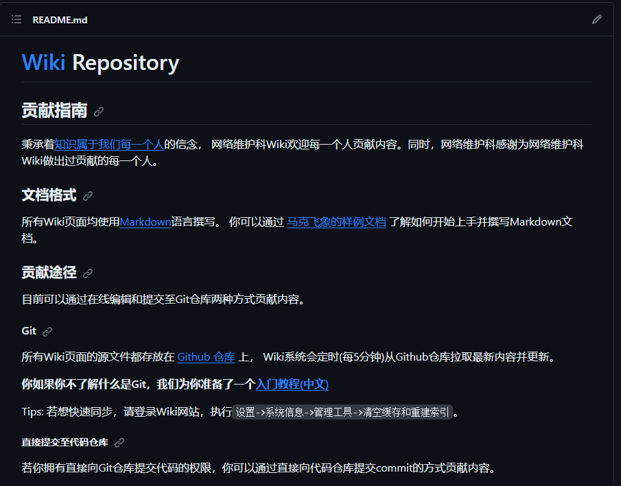

## WIKI是什么

[中山学院网络维护科WIKI(wiki.zsxyww.com)](https://wiki.zsxyww.com/)

- WIKI中收录了三大运营商所有的报错代码与相应的解决方案。
- 由于MAC的特殊性，MAC系统的错误也被单独收录为一个目录。
- 科普文章下面收录了一些常见知识。
- 开发组需要维护wiki形式与内容上面的更新。

---

## WIKI怎么工作的

- WIKI使用了[wikijs](https://js.wiki/) `V1.0`进行部署。
- 因为版本有些老，本学期开发组工作内容会用`V2.0`的`wikijs`重构。。

- 文件同步 使用[Github](https://github.com/ZSCNetSupportDept/wiki)。更新与推送文章只需要发送`PR请求(Pull Request)` 通过则可以至云端。
- 如何使用Github将会在[2.1Git项目管理](2.1Git项目管理.md)进行讲解。
- 每个仓库都会有相关的`PR`规范。前往[wiki仓库](https://github.com/ZSCNetSupportDept/wiki)查看具体细节。
  

---
## WIKI未来规划

- 本学期开始整合wiki进入`WIKI.js V2.0` 
- 更新wiki图片与整理仓库
