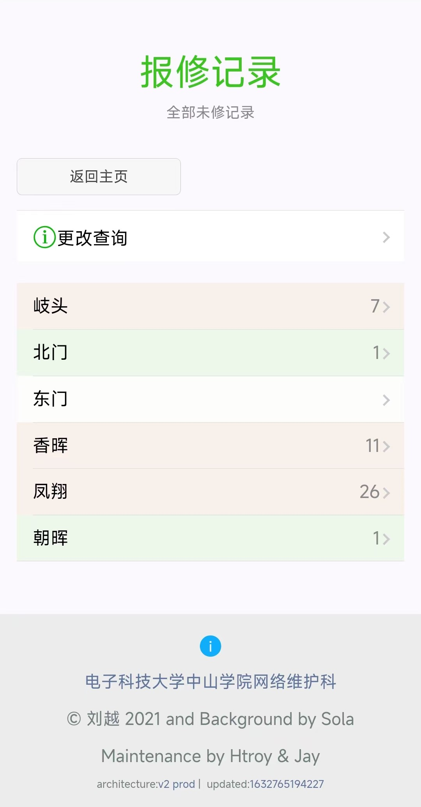

## 报修系统是什么

- 网维”门面“，主要服务项目。
- 展示工单内容：地区、用户信息、错误内容等。

---
## 报修系统如何运作的
- 是以网页形式挂在在微信公众号上。
- 前后端分离： [Github前端仓库（gulp）](https://github.com/ZSCNetSupportDept/WechatTicketSystemFrontend) 、[Github后端仓库（maven）](https://github.com/ZSCNetSupportDept/WechatTicketSystem)。

---

## 报修系统的问题
- 第一次接触的用户搜索的是官方公众号而不是报修系统公众号。
- 错误操作无法撤回。
- 验证超时影响使用体验。
- 后端技术落伍，没有持续更新的必要（本人Arch用户）。
- 运维环境杂乱，维护困难。

---

## 报修系统规划
- 11月项目团队纳新。
- 选型为微信小程序。
- 重新优化操作逻辑。
- 创建`Jenkins`CI/CD流程，保持可靠更新部署。