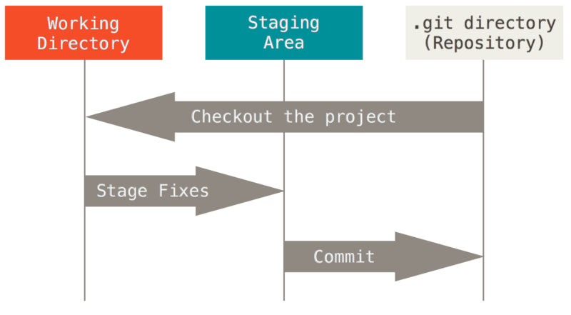
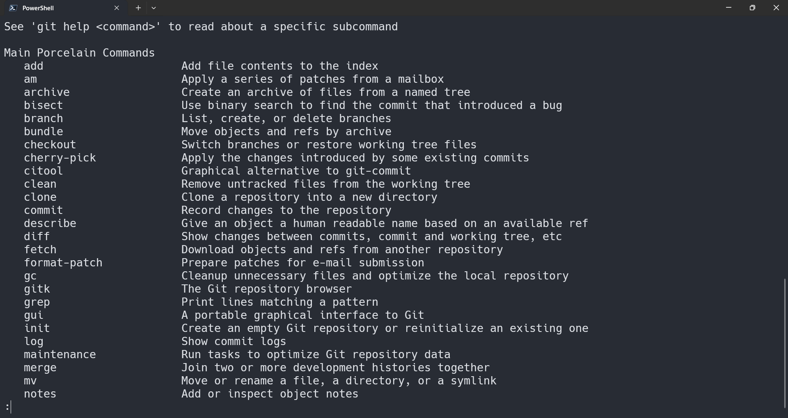
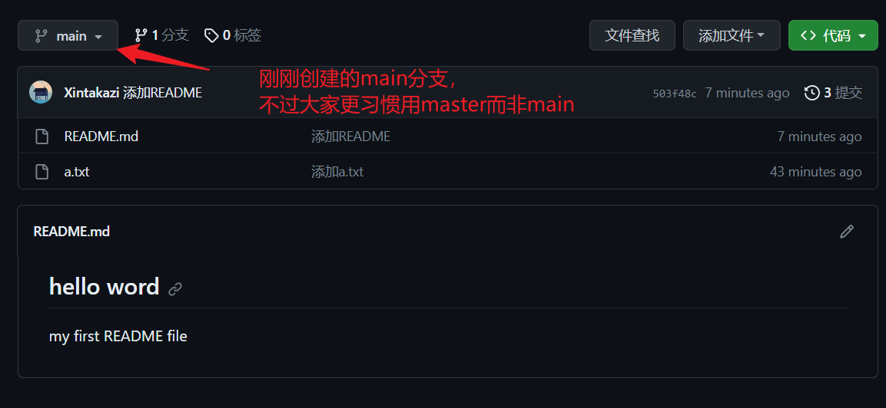

## 什么是git
- 一个分布式版本控制软件。


---

## 为什么有git
- 假设一下你在做题、笔记、日记。。。
- 因为某些原因它消失了，你没有留档，可以为它还有你的时间与精力来举办葬礼了。
- 或者你想在当前文件做一些改动测试，但是你又不想把所有文件都复制一份。


--- 

## Git功能

1. 快照记录

2. 本地操作
3. 哈希校验完整性

- Git 工作的三个区域
- 工作目录、暂存区、git仓库

---
## 使用方法

新的东西就要看看文档：[相关网址](#相关网址)，或者查看帮助

首先需要告诉`Github`是谁再编辑这个仓库。设置一下这台电脑的全局用户配置
```bash
git config --global user.name "YourUserName"
git config --global user.email "YourEmail@example.com"
```
```bash
# 基本本地操作
mkdir repo 
cd repo # 创建文件夹并进入
touch NewFile # 创建文件

git init # 初始化本地仓库
git add NewFile # 添加文件到仓库
# git diff # 查看与上个版本之间的变化
# git status # 查看仓库状态(没有确认更新的文件或者没有跟踪的文件)
git commit -m "确认仓库变化，这里编辑变化信息"
```


> 之前提到了网维的文件都保存在`Github`中，`Github`是一是一个在线软件源代码托管服务平台。背后是微软在投资。


#### 首先需要注册一个`Github`账户。
> 可能由于DNS污染原因无法打开。
> [知乎SwitchHosts方案](https://zhuanlan.zhihu.com/p/629079933)
> 然而SwitchHosts项目也是放在Github上面的。
> 我下载下来放到了[临时文件服务器上](http://file.xintakazi.fun/C-IDE/)，如果想要更新可以先用我下载的`SH`打得开`Github`自己去下载最新版本。

#### 创建一个`Github`仓库


> 新的`Github`仓库里面会有提示代码。
> 内容分别是创建一个`新的本地仓库`并添加`远程地址`和把`现有的本地仓库`添加`远程地址`
> 不过在`Github`上面创建好仓库并添加`README`之后再`git pull`下来更方便。

#### 上传文件与编写`README`
以刚刚创建的本地仓库为基础，添加`远程地址`。
```bash
git branch -M main

git remote add origin git@github.com:Xintakazi/temp.git

git push -u origin main
Enumerating objects: 3, done.
Counting objects: 100% (3/3), done.
Writing objects: 100% (3/3), 221 bytes | 221.00 KiB/s, done.
Total 3 (delta 0), reused 0 (delta 0), pack-reused 0
To github.com:Xintakazi/temp.git
 * [new branch]      main -> main
branch 'main' set up to track 'origin/main'.
```
#### 编写`README`
- README是仓库根目录下面展示的页面，采用markdown语言编写。
把下面的代码放入`README.md`文件，add, commit - m, push 到远程。
```markdown
# hello word
my first README file
```
命令
```bash
git add README.md
git commit -m "添加README"
git push
```
接下来你就可以看见你刚刚写的README了

#### 试一下吧
上面是如何增添文件到远程仓库，现在来实践一下我们的`wiki`更新是如何工作的吧。


## 相关网址
- [Git 官网](https://git-scm.com/)
- [Git官方中文文档](https://git-scm.com/book/zh/v2)
- [Git 练习场](https://learngitbranching.js.org/?locale=zh_CN)
- [Runoob教程](https://www.runoob.com/git/git-tutorial.html)
- [10-27号下载的存档](http://file.xintakazi.fun/C-IDE/)