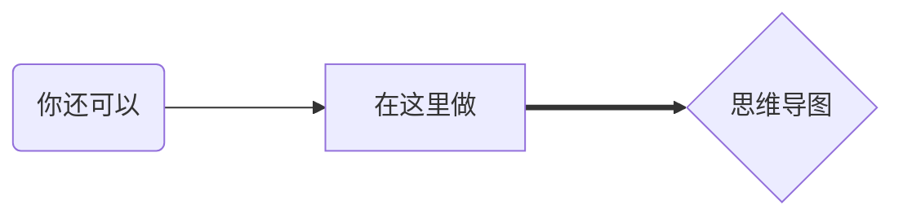

## Markdown 语言是什么

Markdown是一种轻量级标记语言，排版语法简洁，让人们更多地关注内容本身而非排版。它使用易读易写的纯文本格式编写文档，可与HTML混编，可导出 HTML、PDF 以及本身的 .md 格式的文件。因简洁、高效、易读、易写，Markdown被大量使用，如Github、Wikipedia、简书等。

## Markdown 语言怎么写

```markdown
标题最多六级
# 一级
## 二级
### 三级
#### 四级
##### 五级
###### 六级

也可用html写法
<h1>一级标题</h1>
```
标题最多六级
# 一级
## 二级
### 三级
#### 四级
##### 五级
###### 六级

也可用html写法
<h1>一级标题</h1>

---
## 段落

```markdown
定格书写
自动分段
```

定格书写
自动分段

---
## 换行

```markdown
在一行的末尾添加两个或多个空格  
，然后按回车键,即可创建一个换行<br>或者使用`html`的`<br>`来换行
```

在一行的末尾添加两个或多个空格  
，然后按回车键,即可创建一个换行<br>或者使用`html`的`<br>`来换行(适用于表格或者代码块)

---

```markdown
**粗体**
__粗体2__
<strong>粗体3</strong>

*斜体*
_斜体2_
<em>斜体3</em>

***粗斜体***
___粗斜体2___
__*反人类粗斜体3*__
_**反人类粗斜体4**_
<strong><em>粗斜体5</em></strong>

```

**粗体**
__粗体2__
<strong>粗体3</strong>

*斜体*
_斜体2_
<em>斜体3</em>

***粗斜体***
___粗斜体2___
__*反人类粗斜体3*__
_**反人类粗斜体4**_
<strong><em>粗斜体5</em></strong>

---
## 引用

```markdown
> 引用块

> 多段落
>
> 引用块

> 嵌套式
>
> > 引用块

> `复合`
> - 不同元素
> **的** 
> > **引用块**
```
> 引用块

> 多段落
>
> 引用块

> 嵌套式
>
> > 引用块

> `复合`
> - 不同元素
> **的** 
> > **引用块**

---
## 列表
```markdown 
有序列表
1. 一
2. 二
3. 三

无序列表
- 一
- 二

+ 三
+ 四

* 五
* 六

**无序列表不要混着用**
**错误演示**
- 一
* 二
+ 三
```

有序列表
1. 一
2. 二
3. 三

无序列表
- 一
- 二

+ 三
+ 四

* 五
* 六

**无序列表不要混着用**
**错误演示**
- 一
* 二
+ 三

---
## 代码
```markdown
在一句话中用反引号提一嘴`printf("hello world\n");`
或者使用<code>Html</code>实现

``` 语言
# 这里写代码可以带高亮
printf("hello world\n");
``` (三个反引号可以实现代码块)
```

在一句话中用反引号提一嘴`printf("hello world\n");`
或者使用<code>Html</code>实现

``` C
# 这里写代码可以带高亮
printf("hello world\n");
```

```
#上面三个反引号后面跟mermaid
graph LR
A(你还可以)
B[在这里做]
C{思维导图}
A--->B
B===>C
```

[mermaid相关教程](https://vincentruan.github.io/2020/02/04/Mermaid-%E5%AE%9E%E7%94%A8%E6%95%99%E7%A8%8B/)


---
## 分割线

``` markdown
没有\不然显示不出来
\ ---
\ ***
\ ___
```

---
***
___

## 链接
```markdown 
[markdown链接](./2.2Markdown语言.md)
[带悬停提示的markdown链接](./2.2Markdown语言.md "2.2节")
[文内标题跳转](##链接)
```
[markdown链接](./2.2Markdown语言.md)
[带悬停提示的markdown链接](./2.2Markdown语言.md "2.2节")
[文内标题跳转](##链接)

---
## 表格
```markdown
| 表头1 | 表头2 | 表头3 |
| ----- | :----- | -----: |
| 111   | 222   | 333   |
| 11<br>22<br>33    | 22    | 33      |
```

| 表头1 | 表头2 | 表头3 |
| ----- | :----- | -----: |
| 111   | 222   | 333   |
| 11<br>22<br>33    | 22    | 33      |


