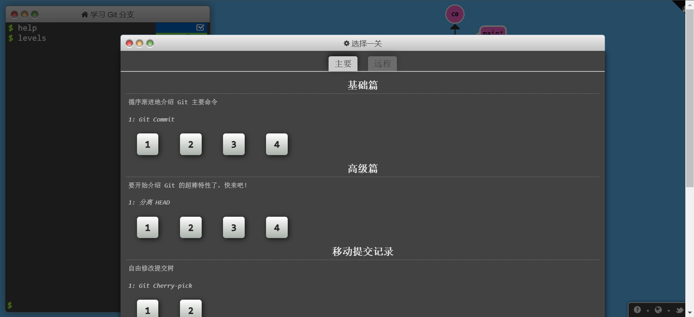
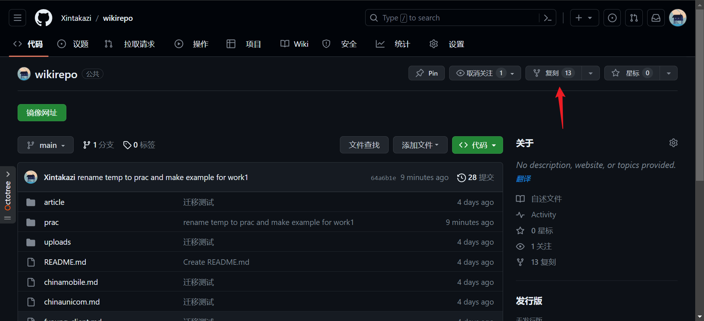
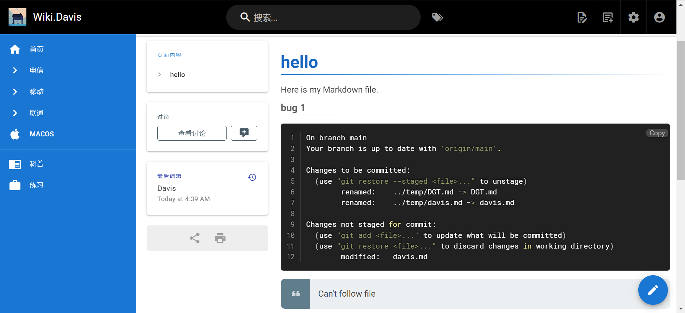
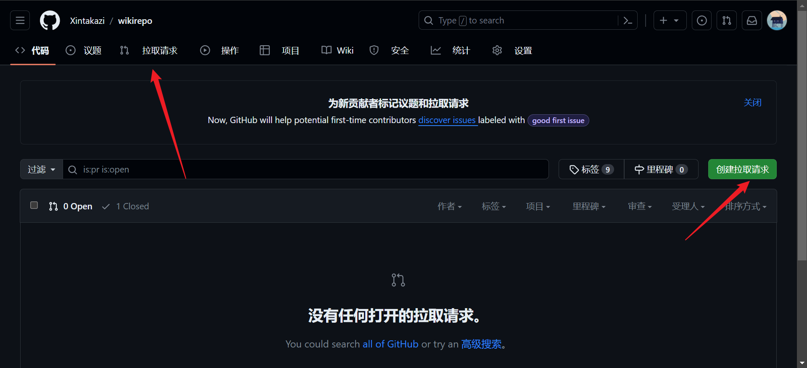

## 作业1
1.  熟练运用git与Markdown语言，可以现在[Git 练习场](https://learngitbranching.js.org/?locale=zh_CN)上练习。
2. fork 并 clone [练习wiki仓库(wikirepo)](https://github.com/xintakazi/wikirepo)到本地。
3. （已有的项目用`git pull`，可能出现文件冲突异常，尝试解决并更新至最新仓库）
4. 在本地的仓库中的`/prac/`创建属于自己的markdown页面。并写下使用`git`与`Markdown`过程中出现的错误与解决方法。
5. 在`/prac/DGT.md`中添加链接到自己的markdown。
6. `git push`到fork的wikirepo中
7. 发起pr到原仓库`https://github.com/xintakazi/wikirepo`。
8. 等待接受pr请求、wikijs自动同步文件、查看自己的页面。

> 学会使用搜索引擎百度、谷歌
> 运用不熟练可以去[Git 练习场](https://learngitbranching.js.org/?locale=zh_CN)先去练练手

